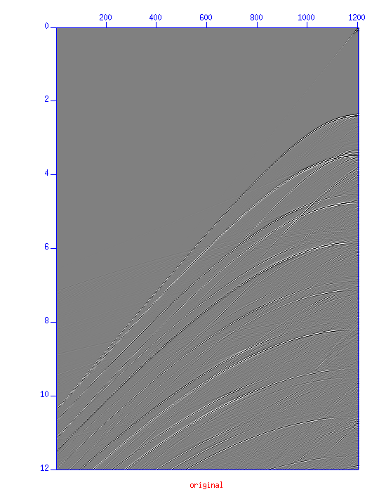
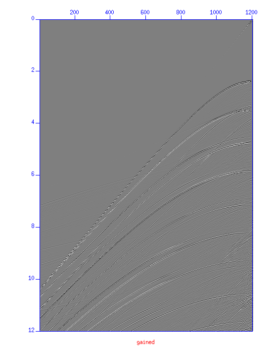
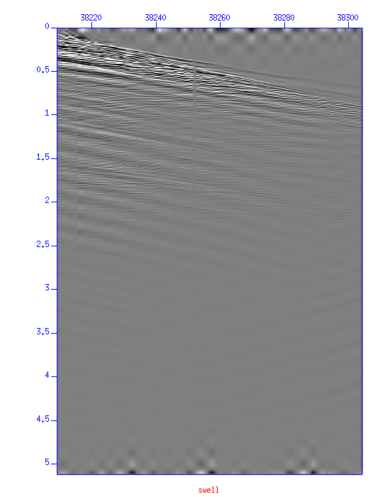
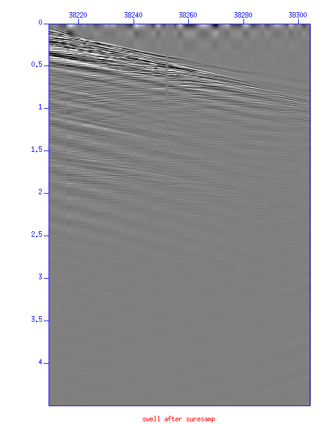

Seismic Unix 명령어 설명
=======================
## 0. 표기
`[ ]`은 코드의 결과를 설명할때 쓰인다.
`{ }`은 option과 argument를 설명할때 쓰인다. 실제 명령어를 사용할 때는 제거할 것
`#`은 주석이다.
***
## 1. 파일 변환하기

### 1.1. segyread

`segyread`는 `*.segy` 파일을 `*.su` 파일로 변환하는 기능을 가진다.

아래는 `input.segy`파일을 little endian 형식의 `output.su` 파일로 변환하는 예제이다.
```
segyread tape=input.segy endian=0 | segyclean > ouput.su
[output.su, binary, header  생성]
```
`endian=0`은 little endian을 의미한다.
`binary`와 `header` 파일은 제거해도 되는 것으로 보인다. (불확실)
`segyclean` 을 같이 수행해야 d1,d2,f1,f2 값에 dummy 값이 들어가지 않는다.

***
## 2. Geometry 읽기, 쓰기, 수정하기

### 2.1. surange

`surange`는 `*.su` 파일의 헤더를 **한꺼번에** 읽는다.

```
surange < input.su (console에 표시할 때)
surange < input.su > output.txt (파일로 저장할 때)
```
결과는 보통 다음과 같은 포맷이다.
```
1618948 traces:
tracl    1 240200 (1 - 177748)
tracr    1 240200 (1 - 177748)
fldr     1 1348 (1 - 1348)
tracf    1 1201 (1 - 1201)
cdpt     1 1201 (1 - 1201)
trid     1   
selev    125
sdepth   125
scalel   -10
scalco   -10
sx       500 674000 (500 - 674000)
gx       -149500 674000 (-149500 - 674000)
ns       2001
dt       6000

Shot coordinate limits:
    North(-50,-0) South(-50,-0) East(-50,-0) West(-67400,-0)

Receiver coordinate limits:
    North(14950,-0) South(14950,-0) East(14950,-0) West(-67400,-0)

Midpoint coordinate limits:
    North(7450,-0) South(7450,-0) East(7450,-0) West(-67400,-0)
```

### 2.2. suedit

`suedit`는 `*.su` 파일의 헤더를 **trace 마다** 읽는다.

순번대로 읽을 수도 있고, 특정한 index를 읽어올 수도 있다.


---
## 3. 전처리 (Preprocessing)

### 3.1. sugain

`sugain`는 `*.su` 파일의 trace에 진폭에 증감을 준다.

`sugain`을 shell에 쳤을때 나오는 전체 옵션중 주요 몇개를 뽑으면 다음과 같다.

```
panel=0	        =1  gain whole data set (vs. trace by trace)
tpow=0.0	multiply data by t^tpow			 	
epow=0.0	multiply data by exp(epow*t)		    	
etpow=1.0	multiply data by exp(epow*t^etpow)	    	
agc=0	   flag; 1 = do automatic gain control	     					
wagc=0.5	agc window in seconds (use if agc=1 or gagc=1)  
```

보통의 경우는 약한 후기신호(트레이스 중후반부에 들어오는 신호)를 증폭시켜주는데 사용한다. 필자의 경험 상 이는 아래와 같은 두 가지 목적을 가진다.

1. 시각적으로 후기신호를 강조하여 보기 위함을 의미한다.
2. 실제로는 3차원으로 전파되어 얻어진 데이터이기 때문에 geometric spreading으로 인한 에너지 감소가 3차원의 식을 따른다. 하지만 2차원 모델링(modeling)을 통하여 역산(inversion) 등을 수행할때는 그 에너지감소가 과다하기 때문에 후기신호를 증폭시킴으로써 이를 보상해준다.

첫번째 목적을 위한 `sugain`의 사용법은 아래와 같다.
```
sugain agc=1 wagc=12.0 < shots0001.su | suximage perc=99 title='gained' [X window 출력]
# '|'라는 pipeline 명령어는 linux 명령어를 참고하면 된다.
```




위 그림을 보면 `original`에 비해 `gained`의 후기 신호가 좀 더 강조됨을 확인할 수 있다.

두번째 목적을 위한 `sugain`의 사용법은 아래와 같다.
```
sugain tpow=0.5 < shots0001.su > shots0001.tpow0.5.su [*.su 파일로 저장]
```
물론 첫번재와 두번째 방법을 수행하기위해 꼭 위와 같이 해야하는 것은 아니다. 다양한 weighting이 가능하다.

### 3.2. suwind

`suwind`는 `*.su` 파일의 일부분을 key에 따라 slicing하는 명령어이다.

```
suwind {key} {min} {max} < {input.su} > {ouput.su} [파일로 출력]
suwind {key} {min} {max} < {input.su} | suximage perc=99 [pipeline으로 넘기기]
```

다음은 key값에 `fldr`을 주고 2225번째 shot gather 만을 뽑아 새로운 `*.su`파일을 만들어내는 예제이다. (sorting은 보장하지 않는다)

```
suwind key=fldr min=2225 max=2225 < 06_Deconvolution.su > 06_Deconvolution.shot2225.su
```
### 3.3. suresamp

`suresamp`는 `*.su` 파일의 일부분을 resample하는 명령어이다.

#### 3.3.1 후기신호 잘라내기 (3.4.1과 연결되는 내용)

swell noise를 제거하기위해 필터를 적용한 결과 아래와 같이 artifact들이 생성되었다. 이를 sumute를 활용하여 제거해보자. 후반부의 신호를 4.5초까지 잘라내도록 하겠다.
```
suresamp nt=2250 <03_Swell_Noise.su > 03_Swell_Noise.cuttail.su
```

*후기 신호 자르기전*

*후기 신호 자른 후*
